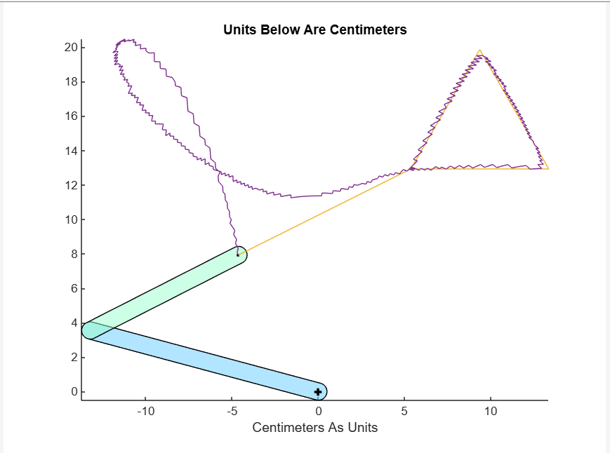
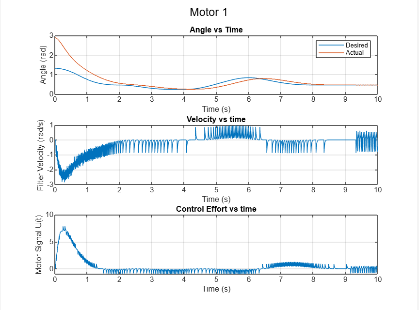
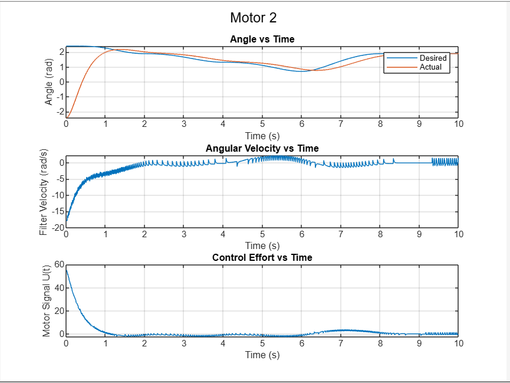
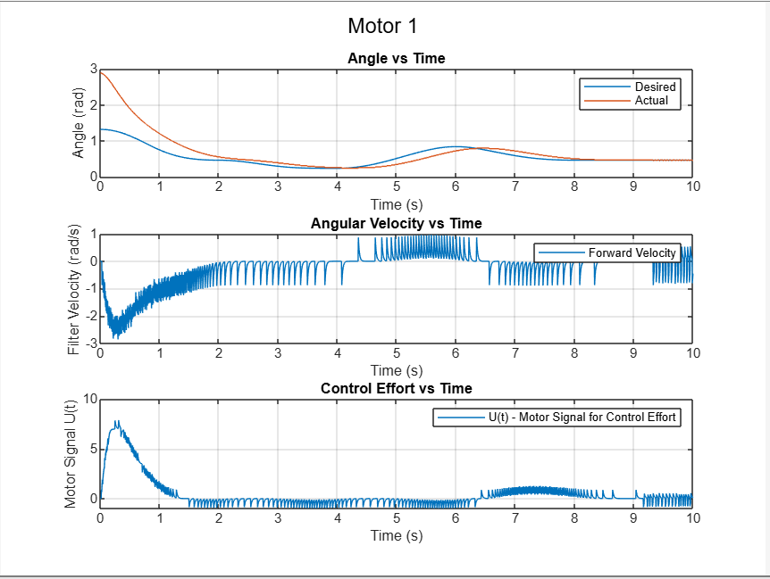
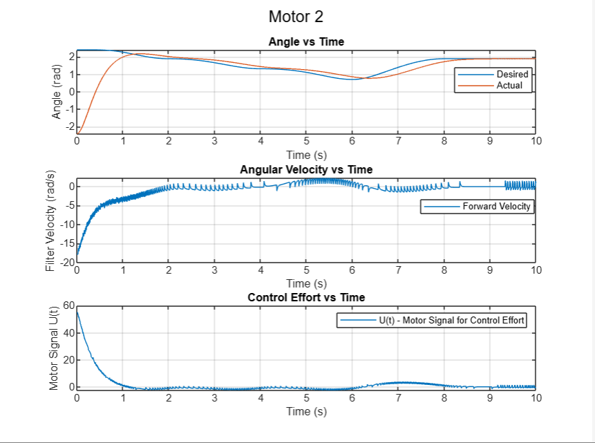

# 2-Link-Robot-Arm-Maze-Control

Details in file .

The goal is to consider the C-space for the 2-link robotic arm, and design a controller having backlashes to move through the maze with least amount of time and effort.
The movement looks like the following image:

The motor controlling exercise for the 2 motors as as follows:

